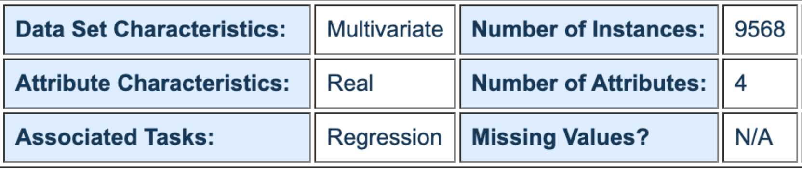
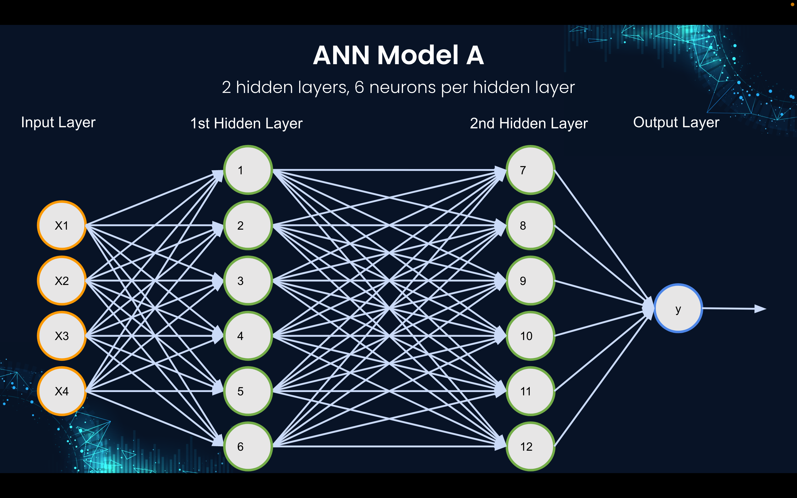
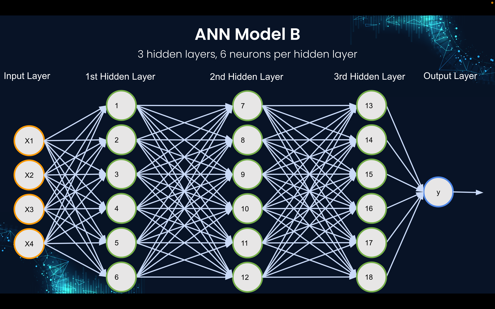
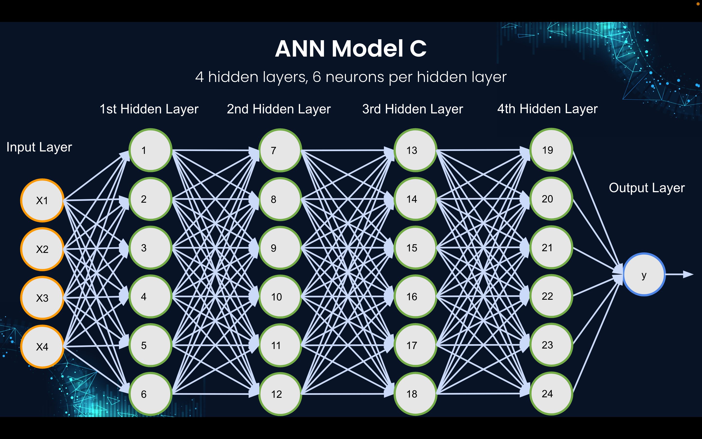
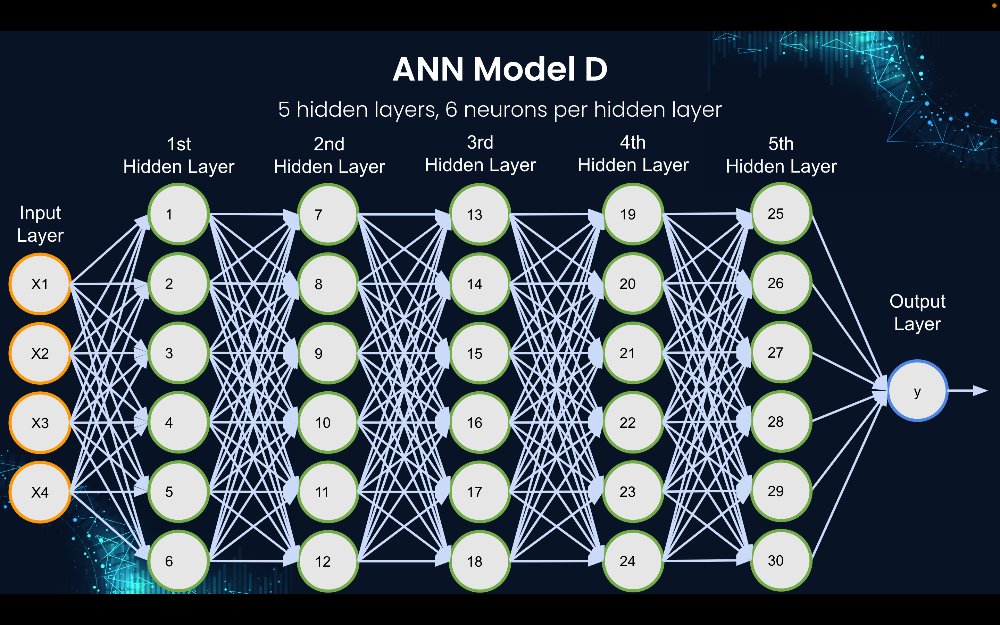
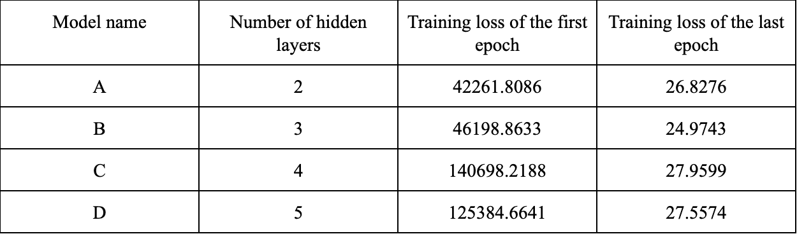
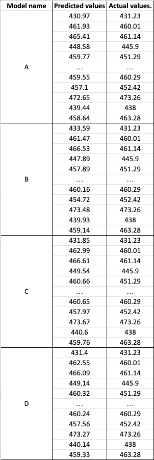

# Artificial Neural Network for Regression

 * Introduction
 * Data
 * Methods
 * Results
 * Discussion and conclusions
 * References

## Introduction

CSCI 4371: Machine Learning - Final Project

In this project, I used the “Combined Cycle Power Plant Data Set” dataset to train my Artificial Neural Network (ANN) models for Regression [1]. As we all know Regression is the branch of Machine Learning where you predict any continuous real values. My goal was to predict the Net hourly electrical energy output (EP) given the 4 attributes namely Temperature (T), Ambient Pressure (AP), Relative Humidity (RH), and Exhaust Vacuum (V). Wondering if adjusting the architecture of the ANN model could result in better performance, I tried out several different architectures with different numbers of hidden layers.

## Data

The dataset I used in this project is the “Combined Cycle Power Plant Data Set” [2] downloaded from the UCI Machine Learning repository. Fortunately, there are no missing pieces of data in this dataset, and all values have the same data type, I did not have to do much with the data preprocessing phase.

The dataset contains 9568 instances. It is multivariate, which means there are several
attributes used to predict our dependent variable. In fact, the first four columns are our attributes including Temperature (T), Ambient Pressure (AP), Relative Humidity (RH), and Exhaust Vacuum (V), and the last column represents the Net hourly electrical energy output (EP) which is our dependent variable. All attributes in our dataset are real numbers.

## Methods

### 1. Importing libraries

For this project, I first imported a few essential libraries which were numpy, pandas, and tensorflow 2.8. The numpy library was for working with large, multi-dimensional arrays and matrices, the pandas library was for processing the dataset in the .csv format, and finally, the powerful tensorflow library helped me with building the artificial neural network.

### 2. Dividing the dataset into the training set and test set

The whole dataset was divided into the training set and the test set. The training set which accounted for 80% of the dataset size was used for the training purpose of the ANN model. Then, the other 20% of the whole dataset belonged to the test set which would be used to estimate the accuracy of the ANN model.
In order to split the dataset, I used the train_test_split method from the model_selection module of the sklearn library and initialized the test_size to 0.2 meaning that the size of the test set was 20% of the whole dataset.

### 3. Building the Artificial Neural Network models

I created an instance of the Sequential()class from the keras interface of the tensorflow library. This instance was called ann which is our ANN model. The reason why I chose the Sequential()class was that I wanted to group a linear stack of layers into my model.

After initializing the ANN model, I started to add several hidden layers to it. Each hidden layer contained 6 neurons and utilized the Rectified Linear activation function, also known as ReLU. I tried adding different numbers of hidden layers to make several architectures of my ANN. Following are the figures for each of these architectures.

- Figure 1. ANN Model A with 2 hidden layers, 6 neurons per hidden layer

- Figure 2. ANN Model B with 3 hidden layers, 6 neurons per hidden layer

- Figure 3. ANN Model C with 4 hidden layers, 6 neurons per hidden layer

- Figure 4. ANN Model D with 5 hidden layers, 6 neurons per hidden layer

After adding multiple hidden layers, I added the output layer to my neural network. There was only one neuron in this output layer. Since I was predicting a continuous real value, no activation function was required for this final layer.

### 4. Training the Artificial Neural Network models

The next step was to train the ANN models. In order to do this, I had to compile the ANN with the compile() method of the Sequential()class. This method required 2 parameters optimizer and loss. For the optimizer, I chose the 'adam' optimizer since it was the
5 most commonly-used one. Also, I used 'mean_squared_error' for loss which means the
loss function was 'mean_squared_error'.

After compiling the model, I fitted it into the training set. The whole training process was conducted through 100 epochs with the default value of batch_size. So, what really happened behind the scene? And how did the neural network learn? The input values (𝑥1, 𝑥2, 𝑥3,
𝑥4) were put in the neural network. Each synapse connecting an input with a neuron of the next layer was assigned a weight (𝑤1, 𝑤2, 𝑤3, 𝑤4). The input values went through several hidden
layers and then an output value (𝑦)was calculated. This output value was compared to the actual output value (𝑦) using the loss function ('mean_squared_error'). The lower the loss is, the closer the output value and the actual value are. That was the forward propagation process. Now, the backpropagation was performed when the cost was fed back to the neural network in order to update the weights. Since the goal was to minimize the loss, an ANN model kept updating the weights until the minimal loss was obtained. The process consists of forward propagation and backpropagation was performed on a batch of 32 observations in the training set. The training kept going with many other batches until the end of the training set to finish 1 epoch. The whole training did not finish until 100 epochs were completed.

Once the training had been completed, I let my ANN model predict the results of the test set. The ann object utilized its predict()method on the test set to get the predicted value of each observation. Then, those predictions were compared to the real values in the test set so that we could roughly have an idea of how accurate the model was. The reason why I was not able to make a confusion matrix to analyze the accuracy of my models was that I was dealing with a Regression problem which was not supported to make the confusion matrix.

## Results

### 1. Training loss

Since the confusion matrix did not support Regression, I could not use it to calculate the accuracy of my ANN models. Therefore, one metric I used to evaluate the performance of those models was the decrease in the loss. After running all of my ANN models on the same dataset, I took notes of the losses in the first epoch and the last epoch in the table below.

As we can see, the lowest loss after training seems to belong to Model B. However, this is not always the case. It is hard to tell which model had the highest performance since they were assigned different initial losses. Moreover, every time I reran any of those models, the initial loss and final loss were different. Nevertheless, the good news is that the loss always decreased significantly after running 100 epochs and it was always between 25 and 30, which is not a high loss.

### 2. Predicted values

I ran my code on Google Colab. After running the step of predicting the test set results, I printed out all pairs of predicted and actual values. Based on that, I could roughly evaluate how well my models were performing. The following table shows a few result observations of each model, more details are in the codes.

Looking at how close the predicted values and actual values are, I am somewhat confident about the performance of the four ANN models.

## Discussion and conclusions

It is good to see the loss reduced significantly after 100 epochs during the training. As I have mentioned, I was wondering if adjusting the architecture of the ANN may result in better performance, now it seems that this does not really matter. Amongst models A, B, C, and D, I do not see any model that has an extraordinary performance in comparison to others. Nonetheless, I believe that those models are doing a nice job in predicting the EP since the predicted values are usually pretty close to the actual values in the test set.

## References

1. [Artificial Neural Network for Regression](https://www.udemy.com/course/linear-regression-with-artificial-neural-network/)
2. [Combined Cycle Power Plant Data Set](https://archive.ics.uci.edu/ml/datasets/Combined+Cycle+Power+Plant)
3. [Artificial Neural Network implementation](https://colab.research.google.com/drive/1eje9zILprgVmohMN7cKykI3fn4FBRPnF)
4. [Machine Learning A-ZTM: Hands-On Python & R In Data Science](https://www.udemy.com/course/machinelearning/)
